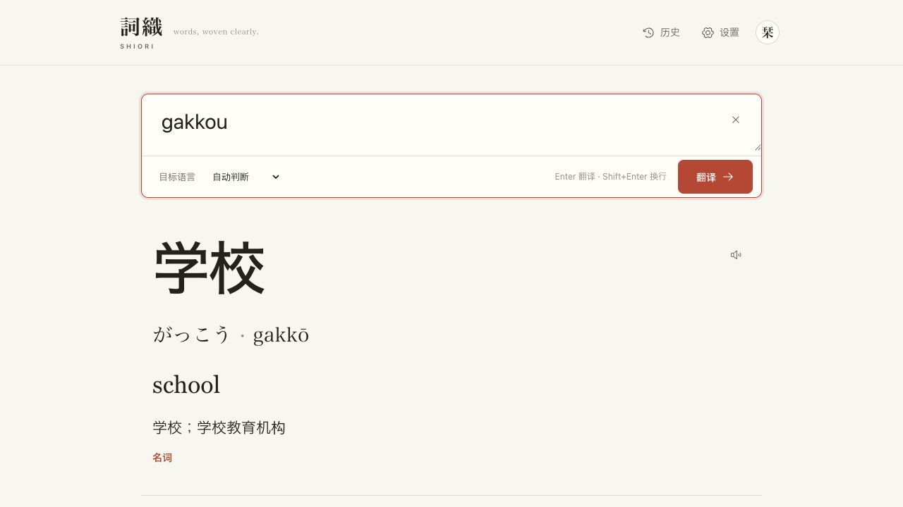

# 詞織 / SHIORI

> words, woven clearly.

[](https://vercel.com/new/clone?repository-url=https%3A%2F%2Fgithub.com%2Ftamakiyou912-wq%2Fshiori-words&project-name=shiori-words&repository-name=shiori-words)

詞織是一个以日语学习为核心的中、日、英 AI 翻译与语言助手。它把本地输入规范化、轻量词典和 AI 结合起来：常见词汇尽量立即出现，复杂翻译、语境、多义词和连续追问再交给用户自己的 AI Provider。



## 主要功能

- 中文、日语、英语与宽松罗马字自动识别；支持六个互译方向。
- 日语读音、罗马字、中英释义、词性、例句和简短语言提示。
- 罗马字默认隐藏；主词旁的 `Aa` 开关会记住这台设备的显示偏好。片假名区分来源／构成与自然英语，同义内容不重复显示。
- 句子学习结果包含中日英对照、整句假名/罗马字、分词读音释义和不同语境表达。
- 中文汉字找日语、繁简/新旧字形兼容、宽松罗马字纠错。
- 支持汉字、平假名、片假名与罗马字混输；连续英文键盘输入会用词典和 beam search 自动分词，例如 `goipurinto → ごい + プリント → 語彙プリント`。
- 罗马字输入可一键切换平假名、片假名或按读音联想汉字；片假名标题按可用宽度自适应，罗马字可通过 Aa 展开。
- 多义词按常见搭配分组；片假名说明来源、现代英语对应词与和制英语。
- 本地词典结果先显示，再由一次 AI 请求补充中文解释、例句和语境；当前结果下方可连续追问。
- DeepSeek 与通用 OpenAI-compatible Provider 抽象；Base URL 和模型均可配置。
- 用户名/密码账号、最近查询历史、可重新打开和删除。
- 用户可创建限次体验码；访客无需注册或填写 API Key。
- 私人实例提供唯一 Owner、开放/邀请/关闭注册、普通用户人数上限和账号停用管理。
- 可安装 PWA，适配 iPhone、iPad、Android 和桌面浏览器。
- 系统深色模式、键盘操作、可见焦点和 safe-area 支持。

## 技术栈

- Next.js 16、React 19、TypeScript、Tailwind CSS 4
- Drizzle ORM
- 本地开发：PGlite（嵌入式、PostgreSQL-compatible）
- 生产：PostgreSQL（Neon、Supabase、Railway、自建 PostgreSQL 等）
- 自建 HttpOnly Session；bcrypt 密码 Hash
- AES-256-GCM 加密 API Key
- Vitest

## 本地运行

需要 Node.js 22+。

```bash
git clone https://github.com/your-name/shiori.git
cd shiori
npm install
cp .env.example .env
```

生成本地加密密钥和一次性 Owner 初始化令牌（写入权限为 `600` 的 `.env`，不会打印到终端）：

```bash
npm run setup
```

初始化数据库并启动：

```bash
npm run db:migrate
npm run dev
```

打开 `http://localhost:3000/setup`，使用 `.env` 中的 `OWNER_SETUP_TOKEN` 创建唯一 Owner。完成后 `/setup` 永久失效。Owner 再到「设置」填写自己的 Provider、API Key、Base URL 和模型。

## 环境变量

| 变量 | 必需 | 说明 |
| --- | --- | --- |
| `DATABASE_URL` | 是 | 本地可用 `file:./data/shiori`；生产推荐 Neon 的 `-pooler` PostgreSQL URL |
| `DATABASE_MIGRATION_URL` | 否 | migration 可使用的直连 PostgreSQL URL；未设置时复用 `DATABASE_URL` |
| `ENCRYPTION_KEY` | 是 | 32 字节 Base64 或 64 位十六进制密钥，只用于服务器端凭据加密 |
| `OWNER_SETUP_TOKEN` | 是 | 至少 32 字符的高强度随机值，只用于第一次创建唯一 Owner |
| `SESSION_COOKIE_NAME` | 否 | 登录 Cookie 名称 |
| `GUEST_COOKIE_NAME` | 否 | 体验模式 Cookie 名称 |
| `DEFAULT_AI_PROVIDER` | 否 | Provider 默认值；界面仍可修改 |
| `DEFAULT_AI_BASE_URL` | 否 | Provider Base URL 默认值 |
| `DEFAULT_AI_MODEL` | 否 | 模型默认值；不会锁死，用户可获取列表或手动输入 |
| `ALLOW_INSECURE_PROVIDER_URLS` | 否 | 仅在明确需要本地 HTTP Provider 时设为 `true`；生产不建议 |

不要把 `.env`、数据库密码、API Key 或 `ENCRYPTION_KEY` 提交到 Git。

应用的页面、API、Manifest 和 Service Worker 全部使用相对同源 URL，因此不需要 `NEXT_PUBLIC_APP_URL`，也没有硬编码 `localhost` 或生产域名；Vercel Preview、Production 与未来自定义域名会自动工作。Session 使用数据库中的高熵随机 Token，其 SHA-256 Hash 持久化在 PostgreSQL，不依赖进程内存，因此不需要额外的 `AUTH_SECRET` / `SESSION_SECRET`。每次设备登录都会创建独立的 30 天 Session；退出只影响当前设备，修改密码或 Owner 强制注销会撤销该账号的全部 Session。

## AI Provider

首版内置两个配置入口：

- `DeepSeek`：默认 Base URL 为 `https://api.deepseek.com`。
- `OpenAI-compatible`：适合其他提供 `/chat/completions` 和可选 `/models` 的服务。

模型名不是不可修改的常量：可以通过环境变量给出默认值，也可以在设置中替换；Provider 支持 `/models` 时可在保存凭据后拉取列表。

一次主查询最多发出一次 Chat Completions 请求。语言检测、Unicode/空白规范化、Kana/Romaji 转换、词典检索、模糊匹配和混合输入分词都在本地完成；模型只补充自然翻译、中文解释、例句、片假名来源和语境。

普通查词和简单句使用非思考模式、1–2 个短例句；只有超过 240 字符的输入或询问语法／细微区别的上下文追问才启用 DeepSeek 的低强度思考（[官方配置](https://api-docs.deepseek.com/guides/thinking_mode/)）。判断在本地完成，不增加 API 调用。服务端等待完整 JSON，先严格解析，再对轻微格式错误做本地修复；单个可选字段失败不会丢弃整条结果，也不会为了修 JSON 再调用 AI。浏览器仍先收到本地结果，不解析未完成的模型 JSON。

Owner 可在首页 URL 后加 `?diagnostics=1` 测量未缓存的查询。它只跳过应用结果缓存，不绕过限流／体验次数，也不能关闭 Provider 的提示缓存；折叠区域仅显示本次时延、调用数与 Token 用量。普通用户和访客不能启用该测量模式。对比语料在 `tests/fixtures/katakana-benchmark.json`，请勿拿含私人上下文的查询做公开基准。

## 安全设计

- API Key 只通过 HTTPS 请求提交到服务端。
- 服务端使用 `ENCRYPTION_KEY` 和 AES-256-GCM 加密后保存；数据库没有明文 Key。
- 已保存 Key 的 API 只返回 `hasKey` 和固定掩码，不返回密文、末尾字符或完整 Key。
- API Key 不写入前端包、localStorage、响应正文或日志。
- 密码使用 bcrypt；Session Token 只以 SHA-256 Hash 形式入库，浏览器 Cookie 为 HttpOnly、SameSite=Lax。
- `/setup` 只接受服务器 `OWNER_SETUP_TOKEN`，事务与数据库唯一索引共同保证只能创建一个 Owner；Owner 不能经普通管理 API 停用、删除或降级。
- 注册、登录和邀请码尝试均有限流；人数上限与注册邀请码次数在数据库事务内检查，防止并发突破。
- 体验码在数据库中原子 `UPDATE ... WHERE used_uses < max_uses`，并按 IP 与体验码限流；失败的 Provider 请求会归还预留次数。
- Provider Base URL 默认必须使用 HTTPS，且禁止 URL 内嵌账号密码。

## 体验码

登录用户先配置自己的 API，然后在设置页创建体验码。默认 20 次，可自定义次数、名称、启用状态和可选有效期。

一次新翻译、单词查询、语言分析或一条追问各消耗一次。一次结果里的读音、释义、例句和说明不会重复扣次。计数完全在服务器端处理。

## 数据库与部署

### 推荐：Vercel + Neon

1. Fork 仓库，点击上方 **Deploy with Vercel**，或在 Vercel 选择 **Add New → Project → Import Git Repository**。
2. 在 Vercel Marketplace 添加 Neon（推荐就近区域），或在 Neon 手动创建数据库。Production 使用 Neon 的 pooled/serverless `DATABASE_URL`；如单独提供 migration 直连 URL，可设 `DATABASE_MIGRATION_URL`。
3. 本地运行一次 `npm run setup`。把 `.env` 里的 `ENCRYPTION_KEY` 和 `OWNER_SETUP_TOKEN` 分别粘贴到 Vercel 的加密 Environment Variables；不要放进 Git、`NEXT_PUBLIC_*` 或日志。
4. Production 至少配置 `DATABASE_URL`、`ENCRYPTION_KEY`、`OWNER_SETUP_TOKEN`。Preview 应使用独立 Neon branch/database；不要让不可信 Preview 连接生产数据库。
5. 部署。`vercel-build` 会先校验环境、执行幂等 migration，再运行 Next.js production build；缺少 PostgreSQL、加密密钥或 Owner 初始化令牌时会中止。
6. 打开 `https://你的项目.vercel.app/setup`，由实例拥有者亲自输入 `OWNER_SETUP_TOKEN`、Owner 用户名和密码。成功后令牌无法创建第二个 Owner。
7. Owner 在「设置 → 站点管理」创建注册邀请码、设置普通用户上限和注册模式；每位用户登录后填写自己的 DeepSeek API Key。

默认注册模式为“邀请码注册”，普通用户上限为 20（唯一 Owner 不计入）。注册邀请码用于创建正式账号；体验码不创建账号，两者的数据与计数完全分开。

Neon 的 Vercel Integration 可以为 Preview 自动创建隔离 branch。若不使用 Preview 数据库，应关闭 Preview 部署的数据访问，而不是让 Preview 修改 Production 数据。

仓库的 `vercel.json` 默认把 Functions 放在新加坡 `sin1`，与示例正式实例的 Neon 区域一致。自行部署时若数据库位于其他区域，请把 `regions` 改为离数据库最近的单一区域，避免每次页面和 API 请求跨洲访问数据库。

不需要配置服务器公共 DeepSeek Key；每个正式用户使用自己在设置页保存的 Key。连接 GitHub 后，向 `main` push 会自动触发新的 Production Deployment。Vercel 的文件系统不是持久化数据库；不要在生产环境使用 `file:` URL。

### 其他 Node.js 平台

```bash
npm install
npm run db:migrate
npm run build
npm run start
```

项目不依赖 Vercel 专有数据库、队列或缓存能力。

## PWA 添加到主屏幕

- iPhone / iPad Safari：分享 →「添加到主屏幕」。
- Android Chrome：浏览器菜单 →「安装应用」或「添加到主屏幕」。
- 桌面 Chrome / Edge：地址栏的安装图标。

静态外壳和图标可缓存；AI 查询、登录和历史需要网络。项目不会伪装离线 AI。

## 词典与第三方数据

- `public/dictionary/jmdict-common.json.gz` 是从 [JMdict](https://www.edrdg.org/jmdict/j_jmdict.html) 生成的紧凑常用词索引，包含 22,636 条日语词条、读音、词性、常见词标记和英语释义。JMdict 版权归 Electronic Dictionary Research and Development Group，衍生数据采用 [CC BY-SA 4.0](https://creativecommons.org/licenses/by-sa/4.0/)；完整署名见 `public/dictionary/JMDICT_ATTRIBUTION.txt`。
- 上游 JSON 由 [jmdict-simplified](https://github.com/scriptin/jmdict-simplified) 提供。需要更新固定版本数据时运行 `npm run dictionary:sync`；构建和部署不需要联网下载词典。
- Kana/Romaji 基础转换使用 [WanaKana](https://github.com/WaniKani/WanaKana)（MIT），活用回推使用 [kamiya-codec](https://github.com/shogo82148/kamiya-codec)（Unlicense），繁简/字形候选使用 [OpenCC JS](https://github.com/nk2028/opencc-js)（Apache-2.0）。
- `src/lib/language/dictionary.ts` 只保留少量片假名外来语的编辑性补充说明，不承担通用查词。

应用代码本身采用 MIT License；Fork 或再发布时请同时保留 JMdict 署名与 CC BY-SA 4.0 说明。

## 开发检查

```bash
npm run typecheck
npm run lint
npm test
npm run build
```

质量基线包含 557 条本地黑盒查询、150 条真实 DeepSeek 端到端查询、300 次请求生命周期压力模拟，以及 JSON 降级恢复、旧请求取消、bcrypt、API Key 加密和体验码 50 路并发下的 20 次原子上限。最新结果与保留失败案例见 [TEST_REPORT.md](TEST_REPORT.md)。

## 项目结构

```text
src/app/                 Next.js 页面与 Route Handlers
src/components/          翻译、结果、账号、历史和设置 UI
src/db/                  Drizzle schema 与数据库适配
src/lib/ai/              一次调用 Provider abstraction 与宽松结构化解析
src/lib/query/           统一查询 pipeline、结果合并和公共词汇缓存
src/lib/language/        规范化、脚本分段、JMdict、罗马字 fuzzy/beam search
drizzle/                 可重复执行的初始迁移
public/                  PWA、图标与紧凑 JMdict 数据
tests/                   单元与并发测试
scripts/qa-*             可复跑的本地与真实 API 黑盒基准
design.md                视觉规范
design-qa.md             最终视觉 QA 记录
```

## 贡献

欢迎 Issue 和 Pull Request。请先阅读 [CONTRIBUTING.md](CONTRIBUTING.md)。

## License

[MIT](LICENSE)
